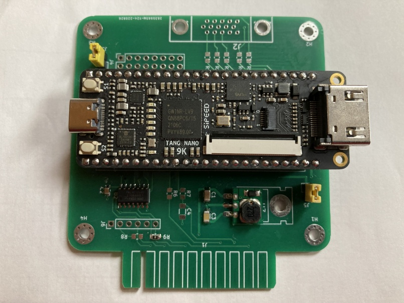

# TRS-80_Display_Adapter
Display board and CRT replacement for TRS-80 Models 3 and 4 and the big Tandy's.

### Overview

The adapter board connects to where the the display board normally connects.  It converts the video signals to HDMI or VGA so a modern monitor can be used instead of the builtin CRT.  The adapter uses a low cost (~$15) Nano-9k FPGA module.

